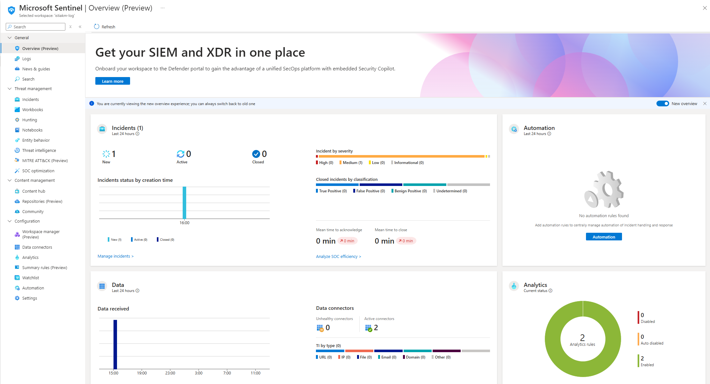

Text can be **bold**, _italic_, or ~~strikethrough~~.

# Creating A Virtual Machine

Microsoft Azure can be accessed for free as a free trial is available for a limited amount of time. This project has been created using a Azure as it has all the tools required for this project. 

Firstly, I set up a virtual machine using the preset configuration. As part of setting up the virtual machine, I created the resource group "IMGroup" which acts as a container for everything created as part of this project. Crucially, I left the RDP port open as I will be generating RDP traffic, which is the most easily generated security event. 

After the virtual machine, "IstiakVM", is set up we can connect to it, view information such as which resource group it belongs to and what operating system it is running.


# Deploying Microsoft Sentinel

Once the virtual machine is set up, we need a log analystics workspace. This is can be done through Microsoft Sentinel. I created a log analytics workspace, "IstiakM-Log", in Microsoft Sentinel and added it to the "IMGroup" resource group set up earlier.


After I created this workspace I added Microsoft Sentinel to the workspace. This is where incidents, automation and data will be presented, as shown below.



# Sending Data To Sentinel

The event logs of the virtual machine created previously need to be sent to the "IstiakM-Log" workspace. The workspace will then send the event log to sentinel.

This can achieved by setting up a data connector. This allows sentinel to get data from the event log of the virtual machine. I selected and installed the "Windows Security Events" connector from _Content Hub_.


Upon the installation of the connector, it show up in the list of data connectors under _Configuration_.


# Creating Data Connection Rule

I created the rule "WindowsEventsToSentinel" within the "Windows Security Events via AMA" connector page and made sure to select the "IstiakVM" as this is where the data will be pulled from. The created will check for successful sign ins via RDP. The MITRE ATT&CK option will is set to _Initial Access_ as this is what I am monitoring. The rule is set to run every 5 minutes. The query used in this rule retrieves security events where a user was successfully able to brute froce access to the virtual machine, excluding any events related to system accounts. 


> The KQL query used in this rule:
> ```kql
> SecurityEvent 
> | where Activity contains "Success" and Account !contains "system"
> ```


The newly created rule,"Successful Sign Ins", will be listed in the _Analytics_ page within sentinel.


# Testing The Rule

Now it is time to test the sentinel rule created. To do this I connected to _IstiakVM_ virtual machine using RDP to trigger an incident. The rule will run every 5 minutes as defined to monitor any successful log in attempts using RDP that is not a system account.

I then checked the _Incidents_ page which showed that my connection via RDP triggered an alert.


The overview page shows the events and alerts overtime as well as the type of data recieved and analytics rules set up.

# Conclusion

Overall, this project has allowed to familirise myself with Microsoft Azure and its capabilities as well get hands on experience building and operating a SIEM and understand how it collects and analyses data from sources. It has further enhanced my understanding of security monitoring and how SOC (Security Operations Center) analysts work to monitor, detect, analyse and respond to security threats.
